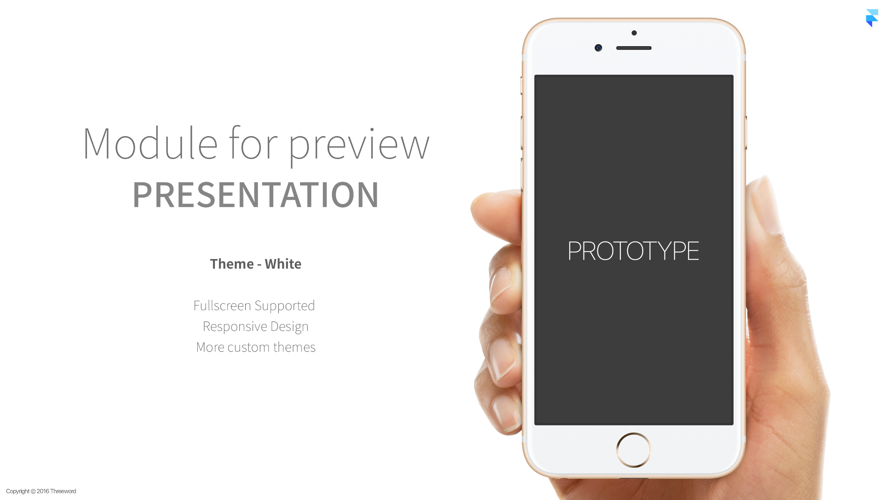
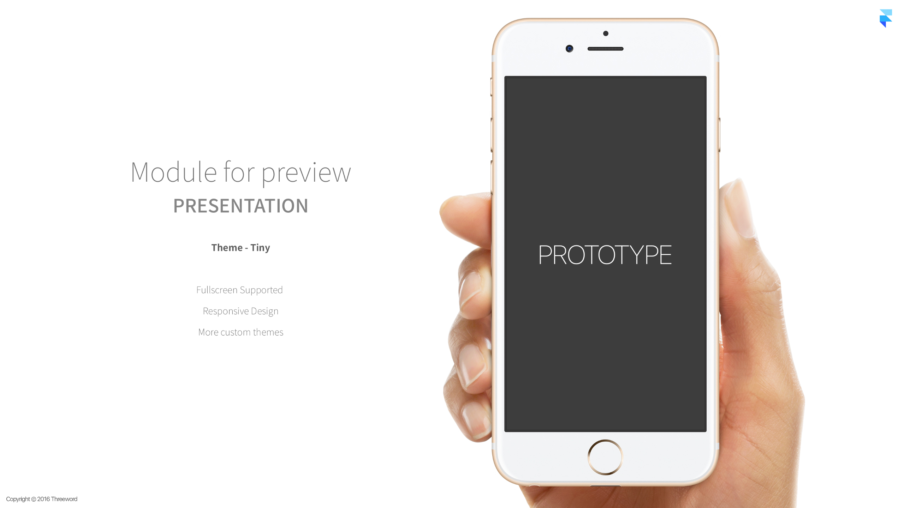
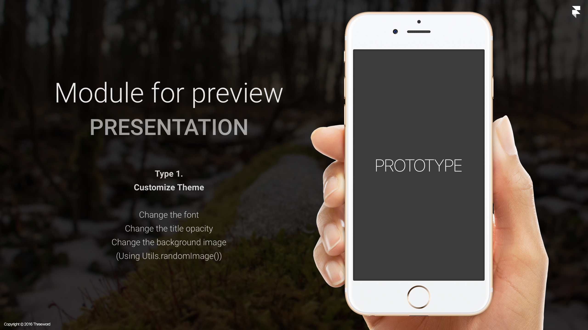

# Introduction for preview (Only desktop)
A Framer Studio module for adding introduction to your project.

[Demo - Image Theme](http://share.framerjs.com/50wic1gr36fv/)

[Demo - Custom Theme](http://share.framerjs.com/1up08x3hq536/)

# Features
- Fullscreen Supported
- Responsive Design
- More custom themes (White, Tiny, Image)

# Installation
Copy the "module" and "intro" folder (in "image" folder) and paste it into your prototype folder
> More info about modules for Framer Studio: [FramerJS Docs - Modules](http://framerjs.com/docs/#modules.modules)

# Usage
### Properties
* title : Project title
* subTitle : Project subtitle (Task)
* typeNo : Type number
* typeName : Type name
* details : Descriptions of type [Array]
* theme : Theme

```coffeescript
{Intro} = require "Intro"
intro = new Intro
	title: 'Module for preview'
	subTitle: 'PRESENTATION'
	typeNo: ''
	typeName: 'Theme - Tiny'
	details: ['Fullscreen Supported ','Responsive Design', 'More custom themes']
	theme: Intro.Theme.Tiny
```

# Theme 
- [ ] White
- [ ] Image
- [x] **Tiny (Base on White) <- _default_**

> You can add custom themes. See below for details

### Basic Theme
#### White
```coffeescript
{Intro} = require "Intro"
intro = new Intro
	title: 'Module for preview'
	subTitle: 'PRESENTATION'
	typeNo: ''
	typeName: 'Theme - White'
	details: ['Fullscreen Supported ','Responsive Design', 'More custom themes']
	theme: Intro.Theme.White
```


#### Image
```coffeescript
{Intro} = require "Intro"
intro = new Intro
	title: 'Module for preview'
	subTitle: 'PRESENTATION'
	typeNo: ''
	typeName: 'Theme - Image'
	details: ['Fullscreen Supported ','Responsive Design', 'More custom themes']
	theme: Intro.Theme.Image
```


#### Tiny [Default]
```coffeescript
{Intro} = require "Intro"
intro = new Intro
	title: 'Module for preview'
	subTitle: 'PRESENTATION'
	typeNo: ''
	typeName: 'Theme - Tiny'
	details: ['Fullscreen Supported ','Responsive Design', 'More custom themes']
```


### Customize Theme
#### Properties
* name : Theme name
* deviceXPos : X position of device from the center position
* descriptionXPos : X position of description from the center position
* descriptionYPos : Y position of description from the center position
* logoMargin : Framer logo margin
* title : Title properties (Same as Layer properties.)
* subtitle : Subtitle properties (Same as Layer properties.)
* detail : Detail properties (Same as Layer properties.)
* copyright : Copyright properties (Same as Layer properties.)
* logo : Framer logo properties (Same as Layer properties.)
* background : Background properties (Same as Layer properties.)

#### Default values
* devicesXPos : 500
* descriptionXPos : -500
* descriptionYPos : -150
* logoMargin : 10

**Step 1. Expand the "IntroTheme" class, create a custom theme class.**
```coffeescript
{IntroTheme} = require "IntroTheme"
class CustomThemeIntro extends IntroTheme
	# CSS
	_cssFont = "@import url('https://fonts.googleapis.com/css?family=Roboto'); font-family: 'Roboto', serif, sans-serif;"
	Utils.insertCSS(_cssFont)

	# Constructor
	constructor: ->
		super 
			# Theme name
			name: 'custom'
			# Project title
			title: 
				style:
					color: "#FFF"
					, font: "100 160px/100px Roboto"
					, textAlign: "center"
					, opacity: "0.9"
			# Project subtitle
			subTitle: 
				style:
					color: "#FFF"
					, font: "500 130px/100px Roboto"
					, textAlign: "center"
					, opacity: "0.6" 
			# Project detail
			details: 
				style: 
					color: "#FFF"
					, font: "200 50px/80px Roboto"
					, textAlign: "center"
					, opacity: "0.8"
			# Copyright
			copyright: brightness: 200, saturate: 0, color: "rgba(255,255,255,0.6)"
			# Framer logo
			logo: brightness: 200, saturate: 0
			# Background :: image
			background: image: Utils.randomImage(Framer.Device.background), blur: 3, opacity: 0.2

exports.CustomThemeIntro = CustomThemeIntro
```

**Step 2. Declares a custom theme module and set the theme.**
```coffeescript
{CustomThemeIntro} = require "CustomThemeIntro"
customTheme = new CustomThemeIntro

{Intro} = require "Intro"
intro = new Intro
	title: 'Module for preview'
	subTitle: 'PRESENTATION'
	typeNo: '1'
	typeName: 'Customize Theme'
	details: ['Change the font', 'Change the title opacity', 'Change the background image', '(Using Utils.randomImage())']
	theme: customTheme
```


# License
Intro.framer is released under the MIT license. See LICENSE for details.
